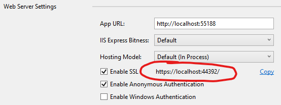

# Stock Indicators for .NET demo

[](https://github.com/facioquo/stock-charts/actions/workflows/build-website.yml)
[](https://github.com/facioquo/stock-charts/actions/workflows/deploy-website.yml)
[](LICENSE)
[](https://github.com/facioquo/stock-charts/issues)
[](https://github.com/facioquo/stock-charts/pulls)

This is a demo of the [Skender.Stock.Indicators](https://www.nuget.org/packages/Skender.Stock.Indicators) NuGet package.  It is an Angular website with a [Chart.js](https://github.com/chartjs/chartjs-chart-financial) financial/candlestick stock chart, with a .NET Web API backend to generate indicators.  The indicator library can be implemented in any .NET compatible ecosystem (it does not have to be in an API like this).  See the [library documentation](https://dotnet.stockindicators.dev) for [more examples](https://dotnet.stockindicators.dev/examples), the user guide, and a full list of available indicators.

Live demo site: [charts.StockIndicators.dev](https://charts.stockindicators.dev/)


## Author's note

This repo and charting tool is primarily intended to demonstrate the [Stock Indicators for .NET](https://dotnet.stockindicators.dev) library.  **It is not meant to be a fully featured charting system** and may not be an architectural model that works for your use case.  If you need a mature charting tool, please explore all of your [charting and visualization options](https://github.com/DaveSkender/Stock.Indicators/discussions/430).

## Running this demo locally

If you want to host on your local computer and review the source code, follow the instructions below.

### Prerequisites

- [Git](https://git-scm.com/) and [Node.js](https://nodejs.org/)
- [Visual Studio](http://visualstudio.com)

### Steps to run

1. [Clone the repo](https://help.github.com/en/github/creating-cloning-and-archiving-repositories/cloning-a-repository)

2. Open `\server\ChartBackend.sln` in Visual Studio.  Take note of the URL in the WebApi project properties.

    

3. Select `WebApi` project and run by either `CTRL+F5` or `dotnet run` CLI command.  You can also View from right-click menus.  If you've done this successfully, a browser window will open and say "API is functioning nominally."  Leave the browser window open.

4. Open `client\src\environments\environment.ts` and modify the API URL, if needed, then save file.

    ```ts
    export const env: EnvConfig = {
      production: false,
      api: 'https://localhost:44392'
    };
    ```

5. Open `Git Bash` window and navigate to the `\client` folder

    ``` bash
    npm install
    npm start
    ```

    The web application should launch automatically.

### Building and Testing

#### Backend (.NET)

To build the backend API:

```bash
# Navigate to the server directory
cd server

# Restore dependencies
dotnet restore

# Build the solution
dotnet build ChartBackend.sln --configuration Release

# Run tests (if any)
dotnet test
```

#### Frontend (Angular)

To build the Angular client:

```bash
# Navigate to the client directory
cd client

# Install dependencies
npm install

# Development build
npm run build

# Production build
npm run build.prod

# Start development server
npm start

# Watch mode (rebuild on changes)
npm run watch
```

### Fetching quote data

Optionally, if you intend to use the local Azure storage emulator to get and store local quote data from the Alpaca API, you'll also need to set some local environment variables and run the ‘Functions.csproj‘ project.  Use your own key and secret values.

``` bash
setx ALPACA_KEY "YOUR ALPACA API KEY"
setx ALPACA_SECRET "YOUR ALPACA SECRET KEY"
setx AzureWebJobsStorage "UseDevelopmentStorage=true"
```

## Using the Dev Container

This repository includes a Dev Container configuration to provide a consistent development environment. The Dev Container includes the following tools and dependencies:

- .NET SDK 9
- Node LTS
- NPM latest
- GitHub CLI
- Angular CLI
- Azure Functions Core Tools
- PowerShell
- ESLint

### Steps to use Dev Container

1. Install [Visual Studio Code](https://code.visualstudio.com/) and the [Remote - Containers extension](https://marketplace.visualstudio.com/items?itemName=ms-vscode-remote.remote-containers).

2. Clone the repository and open it in Visual Studio Code.

3. When prompted, reopen the repository in the Dev Container.

4. The Dev Container will be built and started automatically. You can now use the integrated terminal and other tools within the Dev Container.

### Environment Variables

The Dev Container includes the following environment variables:

- `ALPACA_KEY`
- `ALPACA_SECRET`
- `AzureWebJobsStorage`

These environment variables are required for fetching quote data from the Alpaca API and for local development and debugging of Azure Functions.

## Setting Up Azure Key Vault for Storing Secrets

To securely store and manage secrets such as `ALPACA_KEY` and `ALPACA_SECRET`, you can use Azure Key Vault. Follow the steps below to set up and use Azure Key Vault for storing secrets.

### Steps to use Azure Secrets

1. Create an Azure Key Vault in your Azure subscription.

2. Add the `ALPACA_KEY` and `ALPACA_SECRET` secrets to the Key Vault.

3. Update the application code to retrieve these secrets from Azure Key Vault during runtime.

4. Ensure that the necessary permissions are granted to the application to access the Key Vault.

5. Update the `local.settings.json` file in the `server/Functions` directory to include the `ALPACA_KEY` and `ALPACA_SECRET` environment variables.

6. Update the `README.md` to include instructions for setting up and using Azure Key Vault for storing secrets.

## Using User Secrets for Local Development

For local development, you can use User Secrets to store sensitive information such as `ALPACA_KEY` and `ALPACA_SECRET`. Follow the steps below to set up and use User Secrets for local development.

### Steps

1. In the `server/Functions` directory, run the following command to initialize User Secrets:

    ```bash
    dotnet user-secrets init
    ```

2. Add the `ALPACA_KEY` and `ALPACA_SECRET` secrets to User Secrets:

    ```bash
    dotnet user-secrets set "ALPACA_KEY" "YOUR_ALPACA_API_KEY"
    dotnet user-secrets set "ALPACA_SECRET" "YOUR_ALPACA_SECRET_KEY"
    ```

3. Update the application code to retrieve these secrets from User Secrets during runtime.

4. Ensure that the necessary permissions are granted to the application to access the User Secrets.

5. Update the `README.md` to include instructions for setting up and using User Secrets for local development.

## Contributing

This is an open-source project.  If you want to report bugs, contribute fixes, or add new indicators, please review our [contributing guidelines](docs/CONTRIBUTING.md).

### Development Branch

- **Primary branch**: `main`
- All pull requests should target the `main` branch
- The `main` branch is automatically deployed to the live demo site

### Quick Start for Contributors

1. Fork the repository
2. Clone your fork locally
3. Create a feature branch from `main`
4. Make your changes following our [contributing guidelines](docs/CONTRIBUTING.md)
5. Test your changes locally
6. Submit a pull request to the `main` branch
