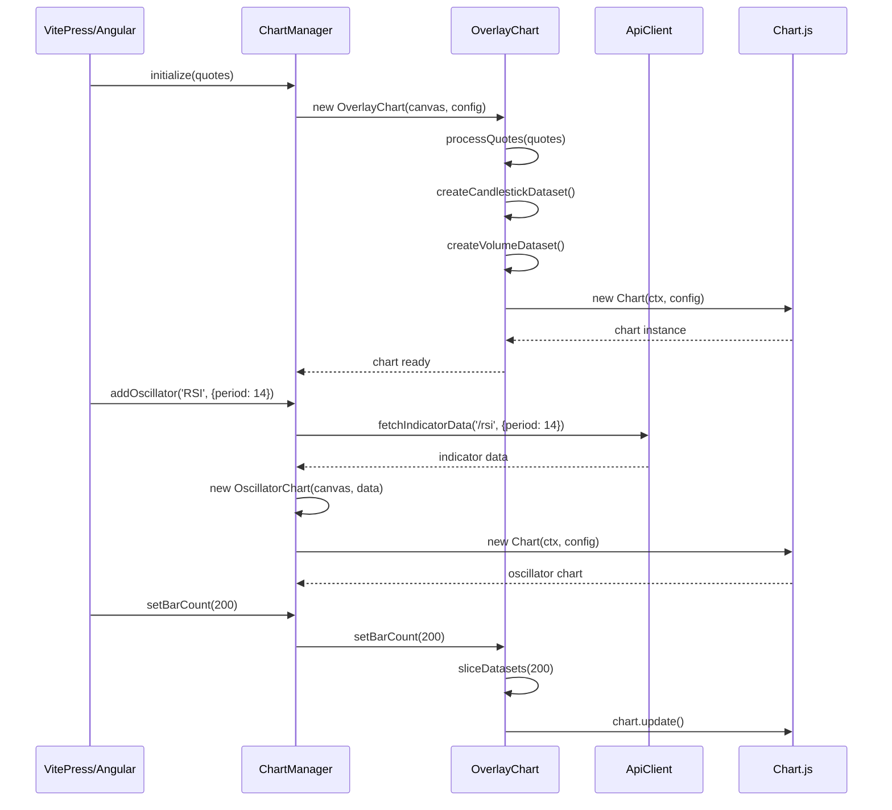

# Approach: Chart System Extraction to @stock-charts/financial

## 1. Key Decisions

### Structure Decisions

#### **Decision: Decomposition by Layer**

**Rationale**: Extract chart functionality in a single layer (presentation/visualization) rather than splitting by domain. All chart-related code moves to the library together.

**Trade-offs**:

- ✅ **Gain**: Clean separation - library owns all chart rendering, Angular app owns business logic
- ✅ **Gain**: Single source of truth for chart behavior
- ❌ **Give up**: Can't extract pieces incrementally (but mitigated by feature flag)

**Implementation impact**: All chart code (file:client/src/chartjs/financial/, file:client/src/app/services/chart.service.ts, file:client/src/app/services/config.service.ts) moves to library in one phase.

---

#### **Decision: High-Level Abstraction (Opinionated API)**

**Rationale**: Provide `OverlayChart` and `OscillatorChart` classes that handle Chart.js complexity internally. Consumers get simple, declarative API.

**Trade-offs**:

- ✅ **Gain**: VitePress examples are concise (5-10 lines of code)
- ✅ **Gain**: Library enforces best practices (performance, theming)
- ❌ **Give up**: Less flexibility for advanced customization
- ❌ **Give up**: Larger library surface area to maintain

**Implementation impact**:

- Create `OverlayChart` class wrapping candlestick + volume + indicators
- Create `OscillatorChart` class wrapping indicator panels
- Create `ChartManager` class coordinating multiple charts
- Hide Chart.js configuration details from consumers

---

#### **Decision: Library Manages Dataset Slicing (Window Resize)**

**Rationale**: Library stores full datasets and slices them based on `barCount` parameter. Consumers just call `setBarCount(n)` on resize.

**Trade-offs**:

- ✅ **Gain**: Simpler consumer code (no dataset management)
- ✅ **Gain**: Consistent slicing logic across all chart types
- ❌ **Give up**: Higher memory usage (library stores full + sliced datasets)
- ❌ **Give up**: More complex library state management

**Implementation impact**:

- `OverlayChart` stores `allQuotes` and `currentBarCount`
- `ChartManager` stores `allProcessedDatasets` Map
- Expose `setBarCount(count)` method for dynamic resizing
- Internal slicing logic handles price, volume, and indicator datasets

---

#### **Decision: Indicator-Aware Library**

**Rationale**: Library knows about specific indicators (SMA, RSI, MACD, etc.) and can fetch/process them via API client.

**Trade-offs**:

- ✅ **Gain**: Simple consumer API: `chart.addIndicator('SMA', { period: 50 })`
- ✅ **Gain**: Library handles indicator metadata, parameters, rendering config
- ❌ **Give up**: Library coupled to backend API structure
- ❌ **Give up**: Adding new indicators requires library update

**Implementation impact**:

- Library includes `IndicatorListing` type definitions
- Library provides `createApiClient(baseUrl)` with `fetchIndicatorData()` method
- `ChartManager.addIndicator(type, params)` fetches and renders
- Indicator catalog can be fetched or provided statically

---

### Transition Decisions

#### **Decision: Big-Bang with Feature Flag**

**Rationale**: Extract everything at once, use feature flag in Angular app to toggle between old and new implementations.

**Trade-offs**:

- ✅ **Gain**: Fastest path to completion (single extraction phase)
- ✅ **Gain**: No intermediate states to maintain
- ✅ **Gain**: Can validate both implementations in parallel
- ❌ **Give up**: Larger initial change surface
- ❌ **Give up**: Rollback requires feature flag flip (not code revert)

**Implementation impact**:

- Add `USE_CHART_LIBRARY` feature flag in Angular app
- Implement library extraction in single phase
- Angular app conditionally uses old ChartService OR new library
- Test both code paths before removing old implementation
- Remove old code and feature flag once validated

---

### Design Decisions

#### **Decision: Global Theme with Chart.js Defaults Mutation**

**Rationale**: Maintain current behavior - theme is global, affects all charts via Chart.js defaults.

**Trade-offs**:

- ✅ **Gain**: Matches current behavior (no breaking changes)
- ✅ **Gain**: Simple API: `applyTheme('dark')` affects all charts
- ❌ **Give up**: Can't have different themes for different charts
- ❌ **Give up**: Mutates global Chart.js state

**Implementation impact**:

- Library exports `applyTheme(mode: 'light' | 'dark')` function
- Internally calls `applyFinancialElementTheme(palette)`
- Mutates `Chart.defaults.elements.candlestick` colors
- Charts call `updateTheme()` to regenerate options with new colors

---

#### **Decision: Built-in LocalStorage Caching**

**Rationale**: Library provides automatic persistence of chart state (selections, settings) to localStorage.

**Trade-offs**:

- ✅ **Gain**: Consumers get persistence for free
- ✅ **Gain**: Matches current Angular app behavior
- ❌ **Give up**: Requires browser environment (not SSR-safe)
- ❌ **Give up**: Library assumes localStorage availability

**Implementation impact**:

- `ChartManager` has `enableCaching(key: string)` method
- Automatically saves selections to `localStorage.getItem(key)`
- Restores state on initialization
- Provide SSR guard: skip caching if `typeof window === 'undefined'`

---

#### **Decision: Optional HTTP Client for API Integration**

**Rationale**: Library includes `createApiClient(baseUrl)` with fetch methods, but also accepts pre-fetched data.

**Trade-offs**:

- ✅ **Gain**: VitePress can use static JSON OR fetch dynamically
- ✅ **Gain**: Library works standalone (no backend required for static data)
- ❌ **Give up**: Library has HTTP dependency (fetch API)
- ❌ **Give up**: More library code to maintain

**Implementation impact**:

- Export `createApiClient(baseUrl)` factory
- Provide `fetchQuotes()`, `fetchIndicatorListings()`, `fetchIndicatorData()` methods
- Also accept data directly: `new OverlayChart(canvas, { quotes: staticData })`
- VitePress can import JSON and pass directly

---

### Risk Mitigation Decisions

#### **Decision: Minimal Smoke Tests Before Refactoring**

**Rationale**: Add tests for critical paths (chart loads, indicator adds, theme switches) to catch major breakage.

**Trade-offs**:

- ✅ **Gain**: Safety net for most common failures
- ✅ **Gain**: Faster than full characterization tests
- ❌ **Give up**: Won't catch edge cases or complex interactions

**Implementation impact**:

- Add smoke tests for:
  - Chart initialization (overlay + oscillator)
  - Indicator add/remove
  - Theme switching
  - Window resize (dataset slicing)
- Use existing financial plugin tests as foundation
- Run tests in both old and new implementations

---

#### **Decision: Preserve Chart.js Lifecycle and Performance Characteristics**

**Rationale**: Maintain current performance (animation disabled, non-intersecting tooltips, efficient resize).

**Trade-offs**:

- ✅ **Gain**: No performance regressions
- ✅ **Gain**: Existing optimizations carry forward
- ❌ **Give up**: Can't change performance characteristics during refactoring

**Implementation impact**:

- Library enforces `animation: false` in chart options
- Library uses `tooltip.intersect: false` for performance
- Library debounces resize events (150ms, matching current behavior)
- Preserve dataset slicing optimization for large datasets

---

### Mapping & Gaps Decisions

#### **Decision: Angular Services → Library Classes Mapping**

**Current → Target mapping**:

| Current (Angular)                   | Target (Library)                               |
| ----------------------------------- | ---------------------------------------------- |
| `ChartService.loadCharts()`         | `ChartManager.initialize(quotes)`              |
| `ChartService.addSelection()`       | `ChartManager.addIndicator(type, params)`      |
| `ChartService.deleteSelection()`    | `ChartManager.removeIndicator(id)`             |
| `ChartService.onSettingsChange()`   | `applyTheme(mode)` + `chart.updateTheme()`     |
| `ConfigService.baseOverlayConfig()` | Internal to `OverlayChart`                     |
| `ConfigService.baseDataset()`       | Internal to `OverlayChart` / `OscillatorChart` |
| Financial plugin                    | Unchanged (already framework-agnostic)         |

**Translation gaps**:

- **RxJS Observables → Promises**: Library uses Promises for async operations (simpler, framework-agnostic)
- **Angular DI → Constructor params**: Library classes accept dependencies as constructor parameters
- **UserService settings → Theme parameter**: Library accepts `theme: 'light' | 'dark'` directly

**Semantic changes** (intentional):

- Library doesn't auto-load from localStorage on construction (consumer must call `restoreState()`)
- Library doesn't auto-scroll to charts (consumer responsibility)
- Library doesn't manage Angular Material dialogs (consumer responsibility)

---

## 2. Target State

### Structure After Refactoring

**Library (`@stock-charts/financial`)** owns:

- Chart.js financial plugin (candlestick/OHLC controllers, elements)
- High-level chart abstractions (`OverlayChart`, `OscillatorChart`, `ChartManager`)
- Chart configuration builders (internal, not exported)
- Data transformation pipeline (quotes → datasets)
- Theme management (global theme application)
- Optional API client (fetch quotes/indicators)
- Optional localStorage caching

**Angular App** owns:

- UI components (ChartComponent, SettingsComponent, PickConfigComponent)
- Business logic (when to add/remove indicators)
- User interaction handling (dialogs, forms)
- Routing and navigation
- Angular-specific services (ApiService for backend, UserService for settings)

### Properties of Target State

**More modular**:

- Chart rendering is completely isolated in library
- Angular app has zero Chart.js dependencies (imports from library)
- Library can be used in any framework (Vue/VitePress, React, vanilla JS)

**More testable**:

- Library has smoke tests for critical paths
- Library can be tested independently of Angular
- Angular app can mock library for component tests

**Clearer separation**:

- Presentation layer (library) vs business logic (app)
- Framework-agnostic (library) vs framework-specific (app)
- Reusable (library) vs application-specific (app)

### Minimum Change to Achieve Goal

**Must change**:

1. Extract chart code to library package
2. Publish library to npm as `@stock-charts/financial`
3. Update Angular app to import from library
4. Add TypeScript path mapping for local development

**Can defer**:

- Full test coverage (start with smoke tests)
- Advanced library features (plugins, extensions)
- Performance optimizations beyond current state
- Documentation beyond VitePress examples

---

## 3. Component Architecture

### Core Library Classes

```typescript
// High-level chart abstractions
class OverlayChart {
  constructor(canvas: HTMLCanvasElement | string, config: OverlayChartConfig);
  render(): void;
  addIndicator(type: string, params: Record<string, number>): Promise<void>;
  removeIndicator(id: string): void;
  setBarCount(count: number): void;
  updateTheme(): void;
  destroy(): void;
}

class OscillatorChart {
  constructor(
    canvas: HTMLCanvasElement | string,
    config: OscillatorChartConfig
  );
  render(): void;
  updateTheme(): void;
  destroy(): void;
}

class ChartManager {
  constructor(config: ChartManagerConfig);
  initialize(quotes: Quote[]): void;
  createOverlayChart(canvasId: string): OverlayChart;
  addOscillator(
    containerId: string,
    indicatorType: string,
    params: object
  ): OscillatorChart;
  removeOscillator(id: string): void;
  setBarCount(count: number): void;
  updateAllThemes(): void;
  enableCaching(key: string): void;
  restoreState(): void;
  destroy(): void;
}
```

### Core Interfaces

```typescript
interface OverlayChartConfig {
  quotes: Quote[];
  theme?: "light" | "dark";
  barCount?: number;
  indicators?: IndicatorConfig[];
}

interface OscillatorChartConfig {
  indicatorData: IndicatorDataRow[];
  indicatorConfig: IndicatorResultConfig;
  theme?: "light" | "dark";
  barCount?: number;
}

interface ChartManagerConfig {
  theme?: "light" | "dark";
  barCount?: number;
  apiBaseUrl?: string;
  cacheKey?: string;
}

interface Quote {
  date: Date;
  open: number;
  high: number;
  low: number;
  close: number;
  volume: number;
}

interface IndicatorConfig {
  type: string; // 'SMA', 'RSI', 'MACD', etc.
  params: Record<string, number>;
}

interface IndicatorListing {
  name: string;
  uiid: string;
  endpoint: string;
  category: string;
  chartType: "overlay" | "oscillator";
  parameters: IndicatorParamConfig[];
  results: IndicatorResultConfig[];
  chartConfig: ChartConfig | null;
}
```

### API Client Interface

```typescript
interface ApiClient {
  fetchQuotes(): Promise<Quote[]>;
  fetchIndicatorListings(): Promise<IndicatorListing[]>;
  fetchIndicatorData(
    endpoint: string,
    params: Record<string, any>
  ): Promise<IndicatorDataRow[]>;
}

function createApiClient(baseUrl: string): ApiClient;
```

### Data Flow Sequence



### State Management

**OverlayChart state**:

- `allQuotes: Quote[]` - full dataset
- `currentBarCount: number` - visible bars
- `chartInstance: Chart` - Chart.js instance
- `indicators: Map<string, IndicatorDataset>` - added indicators

**ChartManager state**:

- `overlayChart: OverlayChart | null`
- `oscillatorCharts: Map<string, OscillatorChart>`
- `allProcessedDatasets: Map<string, ChartDataset[]>` - for efficient slicing
- `config: ChartManagerConfig`
- `cacheKey: string | null` - localStorage key

---

## 4. Invariants

### Behavioral Invariants

**Chart rendering must preserve**:

- Candlestick colors (up=green, down=red, unchanged=gray)
- Volume bar colors (match candle direction)
- Y-axis formatting (dollar signs for price, K/M/B for large numbers)
- X-axis time series behavior (daily candles, proper spacing)
- Tooltip behavior (non-intersecting, shows OHLCV + indicators)
- Legend positioning (top-left corner with backdrop)

**Indicator behavior must preserve**:

- Calculation results (library doesn't change indicator math)
- Line types (solid, dash, dots, bar, pointer, none)
- Threshold lines and fill regions
- Overlay vs oscillator chart placement
- Parameter validation (min/max ranges)

**Theme switching must preserve**:

- Dark theme colors (background, text, grid, candles)
- Light theme colors (background, text, grid, candles)
- Smooth transition (no chart destruction)
- Global application (all charts update together)

### Contract Invariants

**Public API signatures cannot change**:

- `OverlayChart` constructor and methods
- `OscillatorChart` constructor and methods
- `ChartManager` constructor and methods
- `createApiClient()` function signature
- `applyTheme()` function signature

**Data format contracts**:

- `Quote` interface (date, OHLCV fields)
- `IndicatorListing` interface (matches backend API)
- `IndicatorDataRow` interface (matches backend API)
- LocalStorage format (for state restoration)

### Performance Invariants

**Must maintain or improve**:

- Chart initialization time (< 500ms for 250 bars)
- Resize performance (debounced 150ms, smooth updates)
- Indicator add time (< 1s including API call)
- Theme switch time (< 100ms, no flicker)
- Memory usage (reasonable for 500 bars + 10 indicators)

**Animation remains disabled**:

- `animation: false` in all chart configs
- Instant updates on data changes
- No transition animations

### Data Invariants

**Dataset slicing must maintain**:

- Chronological order (newest data on right)
- Consistent bar count across all datasets (price, volume, indicators)
- Array property slicing (pointRotation, pointBackgroundColor, etc.)
- Extra bars padding (7 bars on right edge)

**LocalStorage compatibility**:

- Existing cached selections must load correctly
- New format must be backward compatible OR provide migration
- Cache invalidation on version change (optional)

---

## 5. Test Strategy

### Smoke Tests (Before Refactoring)

**Add minimal tests to catch major breakage**:

1. **Chart Initialization Test**
   - Create OverlayChart with sample quotes
   - Verify chart renders (canvas has content)
   - Verify candlestick and volume datasets exist
   - **Coverage**: Happy path for chart creation

2. **Indicator Add/Remove Test**
   - Create chart, add SMA indicator
   - Verify indicator dataset added
   - Remove indicator
   - Verify dataset removed
   - **Coverage**: Basic indicator lifecycle

3. **Theme Switch Test**
   - Create chart with light theme
   - Switch to dark theme
   - Verify colors changed (sample candle color)
   - **Coverage**: Theme application

4. **Window Resize Test**
   - Create chart with 100 bars
   - Call `setBarCount(50)`
   - Verify datasets sliced to 50 bars
   - **Coverage**: Dataset slicing logic

**Test implementation**:

- Use Vitest (existing test framework)
- Mock canvas context (existing pattern in financial plugin tests)
- Mock API calls (return static data)
- Run tests in CI before merging

### Integration Testing During Refactoring

**Feature flag validation**:

- Run Angular app with `USE_CHART_LIBRARY = false` (old code)
- Run Angular app with `USE_CHART_LIBRARY = true` (new library)
- Manually verify identical behavior:
  - Chart loads with default indicators
  - Add/remove indicators works
  - Theme switching works
  - Window resize works
  - LocalStorage persistence works

**VitePress validation**:

- Create sample VitePress page with static chart
- Create sample VitePress page with interactive chart
- Verify SSR doesn't break (charts render client-side only)
- Verify theme synchronization with VitePress dark mode

### Manual Testing Checklist

**Critical paths to verify**:

- [ ] Chart loads on page load
- [ ] Default indicators display (SMA, BB, RSI, ADX, SUPERTREND, MACD, MARUBOZU)
- [ ] Add new indicator via settings dialog
- [ ] Remove indicator via settings dialog
- [ ] Change indicator parameters (color, period)
- [ ] Switch theme (light ↔ dark)
- [ ] Resize browser window (chart adapts)
- [ ] Refresh page (selections restored from cache)
- [ ] Clear cache (defaults reload)

**Edge cases to verify**:

- [ ] No internet (fallback to backup quotes/indicators)
- [ ] Invalid indicator parameters (validation works)
- [ ] Rapid theme switching (no flicker)
- [ ] Rapid window resize (debouncing works)
- [ ] Many indicators (10+) performance
- [ ] Large dataset (500 bars) performance

### Test Coverage Goals

**Current state**:

- Financial plugin: ~80% coverage ✅
- ConfigService: ~5% coverage ⚠️
- ChartService: 0% coverage ❌

**Target state** (after refactoring):

- Library core (OverlayChart, OscillatorChart, ChartManager): 60% coverage
- Financial plugin: maintain 80% coverage
- Data transformers: 70% coverage
- API client: 50% coverage (mock HTTP calls)

**Acceptable gaps**:

- Complex Chart.js integration (hard to test, covered by manual testing)
- Theme color calculations (visual verification)
- LocalStorage edge cases (browser compatibility)

---

## Summary

This refactoring extracts the chart system into `@stock-charts/financial` library with:

**Architecture**: High-level, opinionated API (`OverlayChart`, `OscillatorChart`, `ChartManager`) that hides Chart.js complexity

**Scope**: Library manages everything - rendering, theming, dataset slicing, indicator fetching, caching

**Transition**: Big-bang extraction with feature flag for parallel validation

**Risk**: Balanced - minimal smoke tests, manual validation, feature flag safety net

**Timeline**: Single extraction phase + validation period before removing old code

The library will work in VitePress (both static and interactive), Angular app, and any other JavaScript environment.
