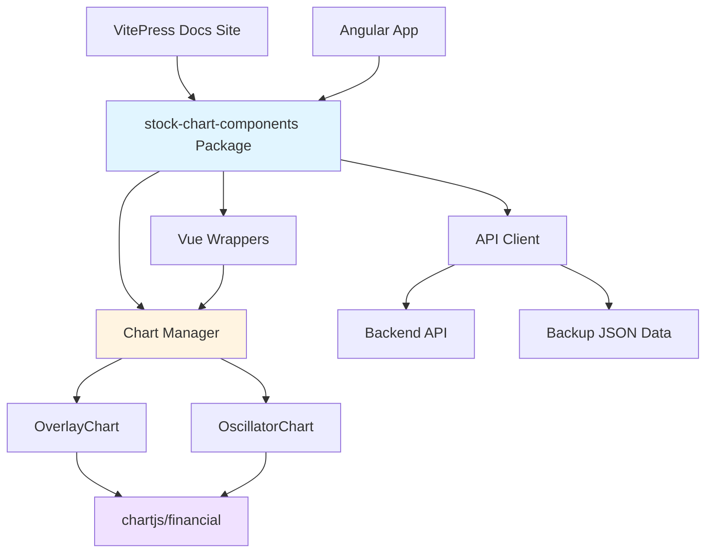

# Plan

> This is an alternate plan proposed by TracerAI bot in [Issue 452](https://github.com/facioquo/stock-charts/issues/452#issuecomment-3909174531)

## Observations

The codebase is a full-stack Angular application with Chart.js-based financial charting. The `file:client/src/chartjs/financial` module is already well-isolated as a Chart.js extension. However, the chart components in `file:client/src/app/pages/chart` and services in `file:client/src/app/services` are tightly coupled with Angular's dependency injection and the current application architecture. The user wants to reuse overlay and oscillator chart types with API integration in a VitePress documentation site with minimal configuration.

## Approach

Create a standalone, framework-agnostic chart library package that can be consumed by both the existing Angular application and the VitePress documentation site. This involves extracting the chart rendering logic into reusable components, creating a simple configuration-based API, and maintaining backward compatibility with the current Angular application. The library will be published as a separate npm package or workspace package that both repositories can import.

## Implementation Steps

### 1. Create Standalone Chart Library Package

Create a new package structure within the monorepo:

```plaintext
client/
  packages/
    stock-chart-components/
      src/
        index.ts
        types/
        components/
        services/
        utils/
      package.json
      tsconfig.json
      README.md
```

Update `file:pnpm-workspace.yaml` to include the new package:

```yaml
packages:
  - client
  - client/packages/*
```

### 2. Extract Core Types and Models

Create framework-agnostic type definitions in `client/packages/stock-chart-components/src/types/`:

- Extract types from `file:client/src/app/pages/chart/chart.models.ts` (Quote, IndicatorListing, IndicatorSelection, etc.)
- Create configuration interfaces for chart options
- Define API response types
- Export all types from a central `index.ts`

### 3. Create Framework-Agnostic API Client

Build a standalone API service in `client/packages/stock-chart-components/src/services/api-client.ts`:

- Extract API logic from `file:client/src/app/services/api.service.ts`
- Replace Angular's HttpClient with native fetch API or axios
- Support configuration via constructor options (base URL, headers, backup data paths)
- Implement methods: `getQuotes()`, `getListings()`, `getSelectionData()`
- Include fallback to backup JSON data when API is unavailable

### 4. Extract Chart Configuration Builder

Create `client/packages/stock-chart-components/src/services/chart-config-builder.ts`:

- Extract configuration logic from `file:client/src/app/services/config.service.ts`
- Remove Angular dependencies (UserService injection)
- Accept theme and settings as constructor parameters
- Provide methods: `buildOverlayConfig()`, `buildOscillatorConfig()`, `buildDataset()`
- Support customization through configuration objects

### 5. Create Reusable Chart Components

Build two main chart component classes in `client/packages/stock-chart-components/src/components/`:

**OverlayChart Component:**

- Extract overlay chart logic from `file:client/src/app/services/chart.service.ts`
- Create class with methods: `initialize()`, `addIndicator()`, `removeIndicator()`, `updateTheme()`, `destroy()`
- Accept configuration object with: API client, theme settings, container element
- Auto-fetch quotes and render candlestick/volume chart
- Support adding overlay indicators dynamically

**OscillatorChart Component:**

- Extract oscillator chart logic from `file:client/src/app/services/chart.service.ts`
- Create class with methods: `initialize()`, `setData()`, `updateTheme()`, `destroy()`
- Accept configuration object with: indicator data, theme settings, container element
- Render oscillator charts with thresholds and legends

### 6. Create High-Level Chart Manager

Build `client/packages/stock-chart-components/src/components/chart-manager.ts`:

- Orchestrate multiple charts (one overlay + multiple oscillators)
- Manage API client instance
- Provide simple API: `addIndicator(config)`, `removeIndicator(id)`, `setTheme(theme)`
- Handle window resize events for responsive charts
- Coordinate data slicing across all charts

### 7. Package the Financial Chart Extension

Ensure `file:client/src/chartjs/financial` is properly packaged:

- Update `file:client/src/chartjs/financial/package.json` to make it publishable (set `private: false`)
- Add build configuration for standalone distribution
- Export all necessary types and functions from `file:client/src/chartjs/financial/index.ts`
- Include as a dependency in the stock-chart-components package

### 8. Create VitePress-Compatible Wrapper

Build Vue 3 wrapper components in `client/packages/stock-chart-components/src/vue/`:

**StockChart.vue:**

- Vue 3 component wrapping OverlayChart
- Accept props: `apiUrl`, `theme`, `indicators` (array of indicator configs)
- Use composition API with `onMounted` and `onUnmounted` lifecycle hooks
- Emit events: `loaded`, `error`, `indicator-added`

**IndicatorChart.vue:**

- Vue 3 component for single indicator display
- Accept props: `indicatorId`, `params`, `apiUrl`, `theme`
- Auto-fetch and render indicator data
- Minimal configuration required

### 9. Update Angular Application

Refactor the existing Angular application to use the new library:

- Update `file:client/src/app/services/chart.service.ts` to use the new chart components
- Create Angular service wrappers that inject the standalone components
- Update `file:client/src/app/pages/chart/chart.component.ts` to use the new API
- Ensure backward compatibility with existing functionality
- Update imports to reference the new package

### 10. Create Configuration Presets

Build preset configurations in `client/packages/stock-chart-components/src/presets/`:

- Default indicator configurations (RSI, MACD, Bollinger Bands, etc.)
- Theme presets (light, dark)
- Chart layout presets
- Export factory functions for common use cases

### 11. Documentation and Examples

Create comprehensive documentation:

- README with installation and usage instructions
- API documentation for all public methods and types
- VitePress usage examples showing minimal configuration
- Angular usage examples
- Migration guide for existing code

### 12. Build and Distribution Setup

Configure build tooling:

- Add TypeScript build configuration (`tsconfig.json`) for the library
- Configure bundler (Rollup or Vite) for ESM and CommonJS outputs
- Set up package.json exports for proper module resolution
- Add build scripts to `file:package.json` root scripts
- Configure peer dependencies (Chart.js, date-fns, etc.)

### 13. Testing Infrastructure

Set up testing for the new package:

- Extract and adapt tests from `file:client/src/test-utils/`
- Create unit tests for API client, config builder, and chart components
- Add integration tests for VitePress usage scenarios
- Configure test scripts in package.json

## Architecture Diagram



## Usage Example for VitePress

```vue
<template>
  <IndicatorChart
    indicator-id="RSI"
    :params="{ lookbackPeriods: 14 }"
    api-url="https://api.stockindicators.dev"
    theme="light"
  />
</template>

<script setup>
import { IndicatorChart } from "@stock-charts/components/vue";
</script>
```
