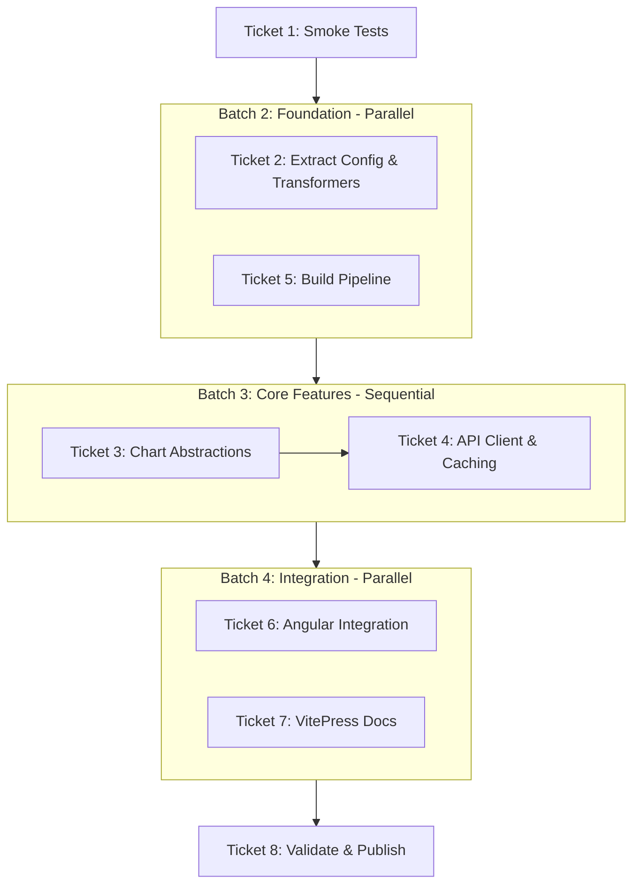

# Plan: componentize charts

## Execution overview

Supporting information:

- [Original problem statement](00-problem.md), see Issue #452
- [Analysis of current codebase](01-analysis.md)
- [Approach for implementation](02-approach.md)

## Implementation tasks

- [x] [Task 1](task-01.md): Add Smoke Tests for Chart Critical Paths ✅
- [x] [Task 2](task-02.md): Extract Chart Configuration and Data Transformation to Library ✅
- [x] [Task 3](task-03.md): Build High-Level Chart Abstractions (OverlayChart, OscillatorChart, ChartManager) ✅
- [x] [Task 4](task-04.md): Implement API Client and LocalStorage Caching in Library ✅
- [x] [Task 5](task-05.md): Configure Library Build Pipeline and Package Metadata ✅
- [x] [Task 6](task-06.md): Integrate Library into Angular App with Feature Flag ✅
- [x] [Task 7](task-07.md): Create VitePress Integration Documentation and Examples ✅
- [x] [Task 8](task-08.md): Validate, Remove Old Code, and Publish Library ✅

## Implementation summary

All tasks completed successfully. The `@stock-charts/financial` library has been extracted from the Angular application and is now available at `client/src/chartjs/financial/`.

### Key deliverables

- **Library modules**: config/, data/, charts/, api/ with framework-agnostic implementations
- **Build pipeline**: TypeScript compilation to `client/dist/financial/`
- **Package metadata**: Updated package.json with proper exports and peer dependencies
- **Angular integration**: Path mapping and feature flag (`useChartLibrary`) for gradual migration
- **Documentation**: Comprehensive README.md with API reference and VitePress integration guide
- **Validation**: All tests pass (85/85), lint clean, builds successful

### Files created/modified

**New library files** (21 files at `client/src/chartjs/financial/`):

- config/{types,common,overlay,oscillator,datasets,annotations,index}.ts (7 files)
- data/{transformers,index}.ts (2 files)
- charts/{overlay-chart,oscillator-chart,chart-manager,index}.ts (4 files)
- api/{client,static,index}.ts (3 files)
- types/chartjs-augment.d.ts (1 file)
- tsconfig.lib.json, package.json (updated), index.ts (updated), README.md (updated) (4 files)

**Modified Angular files** (10 files):

- client/package.json - added `build:lib` script
- client/tsconfig.json - added `paths` mapping for `@stock-charts/financial`
- client/tsconfig.spec.json - updated include pattern
- client/src/environments/environment.interface.ts - added `useChartLibrary` flag
- client/src/environments/{environment.ts,environment.prod.ts} - added feature flag
- client/src/main.ts - import from `@stock-charts/financial`
- client/src/app/services/{chart.service.ts,chart.service.spec.ts} - import from library

**Deleted**: client/src/types/financial-chart.registry.d.ts (moved to library)

### Next steps for publishing

1. Update library version in package.json (currently 1.0.0)
2. Create staging directory with dist/ contents + package.json + README.md + LICENSE
3. Run `npm pack` from staging directory to test package contents
4. Publish to npm: `npm publish` (requires npm registry credentials)
5. Remove `useChartLibrary` feature flag after validation period
6. Remove/deprecate old Angular service methods that duplicate library functionality

## Deferred tasks

<!-- items we identify during implementation that we are deferring for later -->
