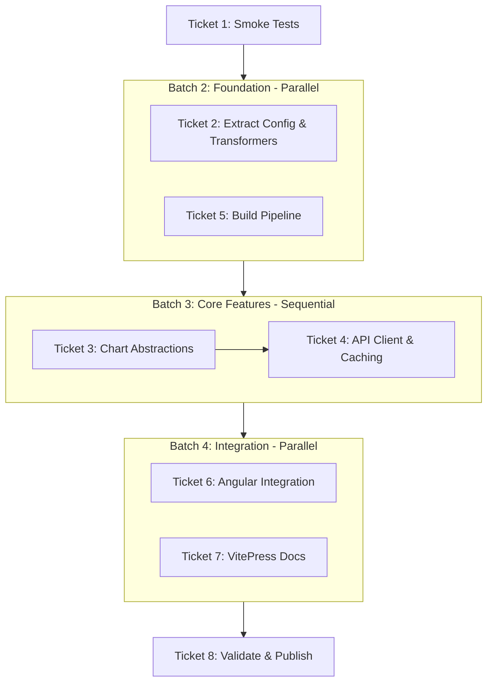

# Plan: componentize charts

## Execution overview

Supporting information:

- [Original problem statement](00-problem.md), see Issue #452
- [Analysis of current codebase](01-analysis.md)
- [Approach for implementation](02-approach.md)

## Implementation tasks

- [ ] [Task 1](task-01.md): Add Smoke Tests for Chart Critical Paths
- [ ] [Task 2](task-02.md): Extract Chart Configuration and Data Transformation to Library
- [ ] [Task 3](task-03.md): Build High-Level Chart Abstractions (OverlayChart, OscillatorChart, ChartManager)
- [ ] [Task 4](task-04.md): Implement API Client and LocalStorage Caching in Library
- [ ] [Task 5](task-05.md): Configure Library Build Pipeline and Package Metadata
- [ ] [Task 6](task-06.md): Integrate Library into Angular App with Feature Flag
- [ ] [Task 7](task-07.md): Create VitePress Integration Documentation and Examples
- [ ] [Task 8](task-08.md): Validate, Remove Old Code, and Publish Library

## Deferred tasks

<!-- items we identify during implementation that we are deferring for later -->
