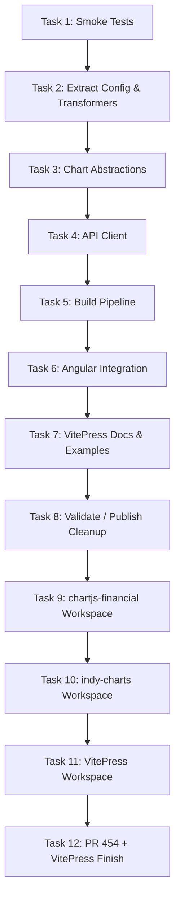

# Plan: Reusable Components (Canonical Tracker)

This file is the canonical tracker for the reusable charts/components work from
Issue #452 and follow-on PR remediation work.

Temporary planning notes under `.claude/plans/` are working drafts only and
must be merged here (or into task files in this folder) before completion.

## Status note

The core extraction, Angular integration, VitePress documentation, and demo
work are complete. Two features from the original plan were not implemented:
**LocalStorage caching** (Task 4) and **npm publishing** (Task 8). Libraries
remain private workspace packages (`v0.1.0`) consumed via pnpm workspace
linking rather than from a public registry.

A PR #454 fix pass on 2026-02-28 addressed remaining CodeRabbit review feedback:
partial-update index bug in financial chart controllers (`elements[dataIndex]`),
MS APT feed scoped to Debian-only in `setup-linux.sh`, duplicate node-check
removed from `setup_node()`, and `Azure.Security.KeyVault.Secrets` downgraded
from pre-release 4.9.0 to stable 4.8.0 with lock files regenerated.

A follow-on fix pass on 2026-02-24 addressed review feedback: `ChartManager.settings`
encapsulation, `ExtendedChartDataset` deduplication across chart classes, business-day
padding in `addExtraBars()`, and removal of a non-idiomatic chart canvas resize pattern.

The previous version of this file had over-reported completion on VitePress
docs/examples and claimed LocalStorage caching that was not implemented. This
was corrected during the Task 12 re-baselining and subsequent implementation.

## Supporting information

- [Original problem statement](00-problem.md), see Issue #452
- [Analysis of current codebase](01-analysis.md)
- [Approach for implementation](02-approach.md)

## Execution overview (historical sequence + current remediation)

## Task status matrix

| Task                  | Title                                                           | Status                                         | Notes                                                                                                                                                                                              |
| --------------------- | --------------------------------------------------------------- | ---------------------------------------------- | -------------------------------------------------------------------------------------------------------------------------------------------------------------------------------------------------- |
| [Task 1](task-01.md)  | Smoke tests for chart critical paths                            | ✅ Complete                                     | Four smoke tests in `client/src/app/services/chart.service.spec.ts` cover init, indicator lifecycle, theme, and dataset slicing.                                                                   |
| [Task 2](task-02.md)  | Extract config and transformers                                 | ✅ Complete (location evolved)                  | Implemented in `libs/indy-charts/config/` and `libs/indy-charts/data/` instead of the originally planned `client/src/chartjs/financial/` paths.                                                    |
| [Task 3](task-03.md)  | High-level chart abstractions                                   | ✅ Complete (location evolved)                  | `OverlayChart`, `OscillatorChart`, `ChartManager` in `libs/indy-charts/charts/` instead of the originally planned `client/src/chartjs/financial/charts/`.                                          |
| [Task 4](task-04.md)  | API client and LocalStorage caching                             | ⚠️ Partial — caching not implemented            | API client (`createApiClient`, `getQuotes`, `getListings`, `getSelectionData`) and static helpers done. `ChartManager.enableCaching()` / `restoreState()` were never built.                        |
| [Task 5](task-05.md)  | Build pipeline and package metadata                             | ✅ Complete (scope evolved)                     | Two workspace packages: `@facioquo/chartjs-chart-financial` and `@facioquo/indy-charts`. Both `private: true`; consumed via workspace linking, not npm.                                            |
| [Task 6](task-06.md)  | Angular integration with feature flag                           | ✅ Complete (approach evolved — no feature flag) | Angular app imports `@facioquo/chartjs-chart-financial` via workspace resolution. No `USE_CHART_LIBRARY` flag; services updated in-place rather than dual code paths.                              |
| [Task 7](task-07.md)  | VitePress integration docs and examples                         | ✅ Complete (via Task 12)                        | All fictional API drift corrected; demonstrator polish, `IndyOverlayDemo`/`IndyIndicatorsDemo` components, Playwright hardened — all completed in Task 12.                                         |
| [Task 8](task-08.md)  | Validate, remove old code, publish                              | ❌ Superseded / not fully executed               | Manual testing complete; Angular services updated (not removed). `USE_CHART_LIBRARY` flag never created. Libraries not published — remain `private: true` at `v0.1.0` via workspace linking only.  |
| Task 9                | Restore standalone `libs/chartjs-financial` workspace           | ✅ Complete                                     | `libs/chartjs-financial/` workspace with `@facioquo/chartjs-chart-financial` package.                                                                                                             |
| Task 10               | Separate `libs/indy-charts` workspace                           | ✅ Complete                                     | `libs/indy-charts/` workspace with `@facioquo/indy-charts` package.                                                                                                                               |
| Task 11               | Add `tests/vitepress` workspace sample                          | ✅ Complete                                     | VitePress workspace with correct APIs, reusable demo components, dark mode, and responsive layout.                                                                                                 |
| [Task 12](task-12.md) | Finish VitePress demonstrator + resolve PR #454 review feedback | ✅ Complete                                     | API drift fixed, `IndyOverlayDemo`/`IndyIndicatorsDemo` components built, Playwright suite 11/11 passing.                                                                                         |

## Current repo baseline

The core reusable component work is complete. PR #454 ("feat: Reusable charts")
is open on `reusable-charts` against `main`.

### Present in repo

- `libs/chartjs-financial/` — standalone workspace (`@facioquo/chartjs-chart-financial`)
  with candlestick, OHLC, and volume Chart.js extensions
- `libs/indy-charts/` — standalone workspace (`@facioquo/indy-charts`) with
  `OverlayChart`, `OscillatorChart`, `ChartManager`, `createApiClient()`, and
  static data helpers
- `tests/vitepress/` — VitePress example workspace with live demos and correct
  API documentation
- `tests/playwright/` — VitePress UI tests (11/11 content tests passing)
- `client/src/app/services/chart.service.spec.ts` — four smoke tests covering
  chart init, indicator lifecycle, theme switching, and dataset slicing

### Not implemented (deferred)

- **LocalStorage caching** (`ChartManager.enableCaching()` / `restoreState()`) —
  was planned in Task 4 but never built
- **npm publishing** — both libraries are `private: true` at `v0.1.0`; consume
  via pnpm workspace linking only
- **Old service removal** — `ConfigService` and `ChartService` remain as Angular
  services; they import from `@facioquo/chartjs-chart-financial` but were not
  replaced with a `ChartManager`-based implementation

## Active focus

### PR #454 open — core work complete

The `reusable-charts` branch is in PR #454 ("feat: Reusable charts"). All
planned implementation tasks are complete or were deliberately scoped out.
Deferred items (caching, publishing) are captured below.

Any new work on deferred items should be tracked in a new task file.

## Deferred / future tasks

The following items were originally in scope but were not implemented:

- **LocalStorage caching** — `ChartManager.enableCaching(key)` and
  `restoreState()` from Task 4. Create a new task if this is needed.
- **npm publish** — both libraries are `private: true` (`v0.1.0`). Requires
  removing `"private": true`, confirming package names/license, and executing
  `pnpm publish`. Create a new task if this is needed.
- **Full `ChartManager` integration in Angular app** — `ChartService` currently
  uses financial chart primitives from `@facioquo/chartjs-chart-financial`
  directly; it was not refactored to delegate chart lifecycle to `ChartManager`
  from `@facioquo/indy-charts`.

## Incorporated alternate-plan notes (historical -> current)

Useful ideas preserved from previous alternate AI-generated plans:

- VitePress examples must support client-only rendering patterns (SSR-safe docs).
- Theme synchronization with VitePress appearance is a first-class docs/demo
  requirement.
- The library should support both fetched data and static data-helper workflows
  for demo/documentation scenarios.
- Consumer-facing examples should prefer minimal, copyable APIs and hide setup
  complexity where possible.

The obsolete alternate plans proposed outdated package structures and APIs and
are not retained as active planning documents.

## Planning hygiene

- `docs/plans/reusable-components/plan.md` is the canonical tracker.
- `docs/plans/reusable-components/task-*.md` hold detailed task specs.
- Temporary `.claude/plans/*` notes must be merged into canonical docs or
  discarded.
- “Complete” claims in this file should only reflect verified repo state.
