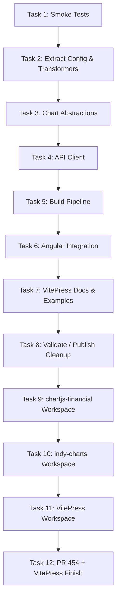

# Plan: Reusable Components (Canonical Tracker)

This file is the canonical tracker for the reusable charts/components work from
Issue #452 and follow-on PR remediation work.

Temporary planning notes under `.claude/plans/` are working drafts only and
must be merged here (or into task files in this folder) before completion.

## Status note (re-baselined)

The previous version of this file became stale and over-reported completion.
Specifically:

- It marked VitePress docs/examples work as complete, but the `tests/vitepress`
  site still contains fictional API snippets and incomplete demo polish.
- It marked API client LocalStorage caching as delivered, but the current
  `libs/indy-charts` API client does not implement caching.
- It described earlier package/layout states that no longer match the repo.

This revision re-baselines task statuses to match the current repository.

## Supporting information

- [Original problem statement](00-problem.md), see Issue #452
- [Analysis of current codebase](01-analysis.md)
- [Approach for implementation](02-approach.md)

## Execution overview (historical sequence + current remediation)

## Task status matrix

| Task | Title | Status | Notes |
|------|-------|--------|-------|
| [Task 1](task-01.md) | Smoke tests for chart critical paths | Complete | Historical task appears complete. |
| [Task 2](task-02.md) | Extract config and transformers | Complete | Implemented via `libs/indy-charts` and supporting modules. |
| [Task 3](task-03.md) | High-level chart abstractions | Complete | `OverlayChart`, `OscillatorChart`, `ChartManager` exist. |
| [Task 4](task-04.md) | API client and LocalStorage caching | Partial | API client exists; caching claims are stale / not implemented in current `libs/indy-charts/api/client.ts`. |
| [Task 5](task-05.md) | Build pipeline and package metadata | Complete | Workspaces/package metadata exist for extracted libraries. |
| [Task 6](task-06.md) | Angular integration with feature flag | Complete (re-verify as needed) | Historical completion accepted; validation can be revisited separately. |
| [Task 7](task-07.md) | VitePress integration docs and examples | Partial | `tests/vitepress` exists, but docs contain fictional APIs and incomplete demonstrator polish. |
| [Task 8](task-08.md) | Validate, remove old code, publish | Needs remediation / superseded in parts | File is stale and over-claims completion/publishing. Treat as historical checklist, not current truth. |
| Task 9 | Restore standalone `libs/chartjs-financial` workspace | Complete | Workspace exists: `libs/chartjs-financial`. |
| Task 10 | Separate `libs/indy-charts` workspace | Complete | Workspace exists: `libs/indy-charts`. |
| Task 11 | Add `tests/vitepress` workspace sample | Partial | Workspace exists; still needs correctness/UX finish work. |
| [Task 12](task-12.md) | Finish VitePress demonstrator + resolve PR #454 review feedback | Open | New remediation task consolidating temporary PR-454 plan work. |

## Current repo baseline (high-level)

The reusable component initiative is substantially implemented, but the final
documentation/demo quality pass is incomplete.

### Present in repo

- `libs/chartjs-financial/` standalone workspace
- `libs/indy-charts/` standalone workspace with chart abstractions and API client
- `tests/vitepress/` VitePress example workspace
- `tests/playwright/` VitePress UI tests

### Remaining finish work (tracked in Task 12)

- Correct VitePress docs/snippets to match actual `@facioquo/indy-charts` APIs
- Finish polish of the VitePress basic chart demonstrator (`/examples/`)
- Harden Playwright selectors/URLs for VitePress default theme behavior
- Fix `libs/indy-charts/README.md` API drift

## Active focus

### Task 12: PR #454 review remediation + VitePress finish

The temporary `.claude` plan for PR #454 has been migrated into
[`task-12.md`](task-12.md). This keeps the canonical status and detailed
acceptance criteria in this folder and avoids duplicate planning tracks.

## Incorporated alternate-plan notes (historical -> current)

Useful ideas preserved from previous alternate AI-generated plans:

- VitePress examples must support client-only rendering patterns (SSR-safe docs).
- Theme synchronization with VitePress appearance is a first-class docs/demo
  requirement.
- The library should support both fetched data and static data-helper workflows
  for demo/documentation scenarios.
- Consumer-facing examples should prefer minimal, copyable APIs and hide setup
  complexity where possible.

The obsolete alternate plans proposed outdated package structures and APIs and
are not retained as active planning documents.

## Planning hygiene

- `docs/plans/reusable-components/plan.md` is the canonical tracker.
- `docs/plans/reusable-components/task-*.md` hold detailed task specs.
- Temporary `.claude/plans/*` notes must be merged into canonical docs or
  discarded.
- “Complete” claims in this file should only reflect verified repo state.

## Deferred / future tasks

<!-- Add newly identified work here after creating a task file or linking to an issue. -->
