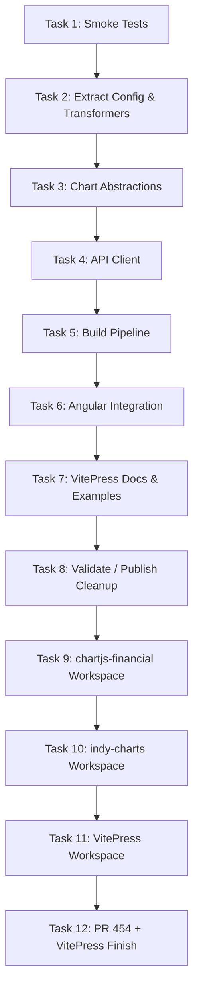

# Plan: Reusable Components (Canonical Tracker)

This file is the canonical tracker for the reusable charts/components work from
Issue #452 and follow-on PR remediation work.

Temporary planning notes under `.claude/plans/` are working drafts only and
must be merged here (or into task files in this folder) before completion.

## Status note

All tasks are complete as of 2026-02-24. Task 12 resolved the final quality
pass: API drift in VitePress docs, demonstrator polish, and Playwright hardening.

The previous version of this file had over-reported completion on VitePress
docs/examples and claimed LocalStorage caching that was not implemented. This
was corrected during the Task 12 re-baselining and subsequent implementation.

## Supporting information

- [Original problem statement](00-problem.md), see Issue #452
- [Analysis of current codebase](01-analysis.md)
- [Approach for implementation](02-approach.md)

## Execution overview (historical sequence + current remediation)

## Task status matrix

| Task                  | Title                                                           | Status                                  | Notes                                                                                                      |
| --------------------- | --------------------------------------------------------------- | --------------------------------------- | ---------------------------------------------------------------------------------------------------------- |
| [Task 1](task-01.md)  | Smoke tests for chart critical paths                            | Complete                                | Historical task appears complete.                                                                          |
| [Task 2](task-02.md)  | Extract config and transformers                                 | Complete                                | Implemented via `libs/indy-charts` and supporting modules.                                                 |
| [Task 3](task-03.md)  | High-level chart abstractions                                   | Complete                                | `OverlayChart`, `OscillatorChart`, `ChartManager` exist.                                                   |
| [Task 4](task-04.md)  | API client and LocalStorage caching                             | Partial                                 | API client exists; caching claims are stale / not implemented in current `libs/indy-charts/api/client.ts`. |
| [Task 5](task-05.md)  | Build pipeline and package metadata                             | Complete                                | Workspaces/package metadata exist for extracted libraries.                                                 |
| [Task 6](task-06.md)  | Angular integration with feature flag                           | Complete (re-verify as needed)          | Historical completion accepted; validation can be revisited separately.                                    |
| [Task 7](task-07.md)  | VitePress integration docs and examples                         | Complete (via Task 12)                  | All fictional API drift corrected; demonstrator polish completed in Task 12.                               |
| [Task 8](task-08.md)  | Validate, remove old code, publish                              | Needs remediation / superseded in parts | File is stale and over-claims completion/publishing. Treat as historical checklist, not current truth.     |
| Task 9                | Restore standalone `libs/chartjs-financial` workspace           | Complete                                | Workspace exists: `libs/chartjs-financial`.                                                                |
| Task 10               | Separate `libs/indy-charts` workspace                           | Complete                                | Workspace exists: `libs/indy-charts`.                                                                      |
| Task 11               | Add `tests/vitepress` workspace sample                          | Complete                                | Workspace complete with correct APIs, reusable components, dark mode, and responsive layout.               |
| [Task 12](task-12.md) | Finish VitePress demonstrator + resolve PR #454 review feedback | Complete                                | All acceptance criteria met: API drift fixed, `IndyOverlayDemo`/`IndyIndicatorsDemo` components, Playwright clean. |

## Current repo baseline

The reusable component initiative is fully implemented. All planned tasks are
complete, including the final documentation/demo quality pass in Task 12.

### Present in repo

- `libs/chartjs-financial/` standalone workspace
- `libs/indy-charts/` standalone workspace with chart abstractions and API client
- `tests/vitepress/` VitePress example workspace with live demos and correct API docs
- `tests/playwright/` VitePress UI tests (11/11 content tests passing)

### Remaining finish work

<!-- All Task 12 remediation items are complete as of 2026-02-24. -->

- [x] Correct VitePress docs/snippets to match actual `@facioquo/indy-charts` APIs
- [x] Finish polish of the VitePress basic chart demonstrator (`/examples/`)
  - Reusable `IndyOverlayDemo.vue` and `IndyIndicatorsDemo.vue` components
  - Loading/error states with `data-testid` hooks
  - Theme sync via `useData().isDark`
  - Responsive canvas (`position: absolute; inset: 0`)
  - Dark mode default via `appearance: 'dark'` in config
- [x] Harden Playwright selectors/URLs for VitePress default theme behavior
- [x] Fix `libs/indy-charts/README.md` API drift

## Active focus

### All planned tasks complete

Task 12 (the final remediation task) is complete as of 2026-02-24. The
`reusable-charts` branch contains:

- Corrected VitePress docs with real `@facioquo/indy-charts` APIs
- Reusable `IndyOverlayDemo.vue` / `IndyIndicatorsDemo.vue` components
- Responsive dark-mode-default VitePress site
- Clean Playwright test suite (11/11 content tests pass)

Any new work should be tracked in a new task file.

## Incorporated alternate-plan notes (historical -> current)

Useful ideas preserved from previous alternate AI-generated plans:

- VitePress examples must support client-only rendering patterns (SSR-safe docs).
- Theme synchronization with VitePress appearance is a first-class docs/demo
  requirement.
- The library should support both fetched data and static data-helper workflows
  for demo/documentation scenarios.
- Consumer-facing examples should prefer minimal, copyable APIs and hide setup
  complexity where possible.

The obsolete alternate plans proposed outdated package structures and APIs and
are not retained as active planning documents.

## Planning hygiene

- `docs/plans/reusable-components/plan.md` is the canonical tracker.
- `docs/plans/reusable-components/task-*.md` hold detailed task specs.
- Temporary `.claude/plans/*` notes must be merged into canonical docs or
  discarded.
- “Complete” claims in this file should only reflect verified repo state.

## Deferred / future tasks

<!-- Add newly identified work here after creating a task file or linking to an issue. -->
