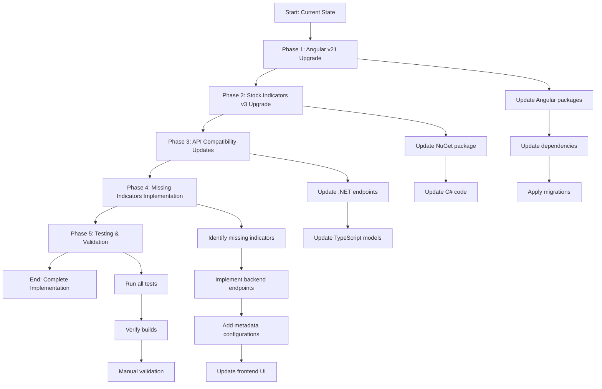

# Plan for Stock.Indicators v3 implementation

This plan outlines the upgrade of Angular from v20 to v21 and the implementation of DaveSkender/Stock.Indicators v3 branch, as proxy for understanding future Skender.Stock.Indicators package interface, with all missing static series-style indicators.

## Solution to implement



This upgrade involves a multi-phase approach that ensures compatibility at each step. We will first upgrade Angular to v21 to leverage the latest framework features, then upgrade the Stock.Indicators package to v3 (using the latest stable version or the most recent preview if stable v3 is not available). Finally, we will implement all missing static series indicators that are available in the library but not yet exposed in the chart options.

## Tasks

### Phase 1: Angular v21 upgrade preparation and execution

- [x] 1.1 Review current Angular v20 configuration and identify breaking changes in v21 release notes
- [x] 1.2 Run Angular CLI update command: `npx ng update @angular/cli @angular/core --allow-dirty` from client directory
- [x] 1.3 Run Angular Material update: `npx ng update @angular/material --allow-dirty` from client directory
- [x] 1.4 Update peer dependencies (@ng-matero/extensions, ngx-color) to versions compatible with Angular v21
- [x] 1.5 Run `npm install` from root to update lockfile and resolve dependency conflicts
- [x] 1.6 Apply any Angular v21 automated migrations and review migration output
- [x] 1.7 Build frontend (`npm run build --workspace=@stock-charts/client`) and fix any compilation errors
- [x] 1.8 Run frontend tests (`npm run test --workspace=@stock-charts/client`) and fix any breaking changes
- [x] 1.9 Run linter (`npm run lint --workspace=@stock-charts/client -- --max-warnings=0`) and resolve issues
- [x] 1.10 Commit Angular v21 upgrade changes with descriptive message

#### .NET 10 server upgrade

- [x] 1.11 Upgrade all server projects (Functions, WebApi) to .NET 10 in their respective .csproj files and solution
- [x] 1.12 Update `Directory.Packages.props` to use .NET 10 SDK and compatible package versions
- [x] 1.13 Run `dotnet build Charts.sln` and resolve any .NET 10 migration issues
- [x] 1.14 Run backend tests (`dotnet test Charts.sln`) to verify .NET 10 compatibility
- [x] 1.15 Commit .NET 10 upgrade changes with descriptive message

### Phase 2: Stock.Indicators NuGet package upgrade to v3

- [ ] 2.1 Check latest Stock.Indicators package version (stable v3 or latest v3 preview) on NuGet.org
- [ ] 2.2 Update `server/Directory.Packages.props` to specify Stock.Indicators v3 version (e.g., 3.0.0 or 3.0.0-preview.1)
- [ ] 2.3 Run `dotnet restore Charts.sln` to download new package version
- [ ] 2.4 Review Stock.Indicators v3 breaking changes and migration guide at <https://dotnet.stockindicators.dev/> or equivalent from source repo
- [ ] 2.5 Build backend (`dotnet build Charts.sln`) and identify compilation errors from API changes
- [ ] 2.6 Update `server/WebApi/GlobalUsings.cs` if namespace changes are required for v3
- [ ] 2.7 Run backend tests (`dotnet test Charts.sln`) to verify compatibility
- [ ] 2.8 Commit Stock.Indicators v3 package upgrade

### Phase 3: Update backend API for Stock.Indicators v3 compatibility

- [ ] 3.1 Review all indicator method calls in `server/WebApi/Endpoints.cs` for v3 API changes
- [ ] 3.2 Update indicator method signatures if v3 introduces breaking changes (e.g., parameter order, types)
- [ ] 3.3 Verify that static series methods (`.GetSma()`, `.GetEma()`, etc.) still work as expected in v3
- [ ] 3.4 Update result type handling if v3 changes result models or property names
- [ ] 3.5 Test each updated endpoint manually using Swagger/API testing tools
- [ ] 3.6 Update TypeScript models in `client/src/app/pages/chart/chart.models.ts` if API response structure changes
- [ ] 3.7 Build both frontend and backend to ensure end-to-end compatibility
- [ ] 3.8 Commit API compatibility updates

### Phase 4: Implement missing static series indicators

- [ ] 4.1 Generate comprehensive list of all static series indicators available in Stock.Indicators v3 from official docs
- [ ] 4.2 Compare available indicators with currently implemented indicators in `server/WebApi/Endpoints.cs`
- [ ] 4.3 Identify missing indicators (e.g., HMA, WMA, TEMA, T3, KAMA, VIDYA, MAMA, FAMA, HT-Phasor, etc.)
- [ ] 4.4 For each missing indicator, add HTTP GET endpoint in `server/WebApi/Endpoints.cs` following existing pattern
- [ ] 4.5 For each missing indicator, add metadata configuration in `server/WebApi/Services/Service.Metadata.cs`
- [ ] 4.6 Define indicator parameters (lookbackPeriods, multipliers, etc.) with appropriate defaults per official docs
- [ ] 4.7 Define indicator result configurations (line types, colors, chart types) for visualization
- [ ] 4.8 Update backup indicator generation script `scripts/generate-backup-indicators.js` to include new indicators
- [ ] 4.9 Generate new backup indicators file by running `npm run generate:backup-indicators`
- [ ] 4.10 Verify frontend picks up new indicators in chart options UI
- [ ] 4.11 Test each new indicator by selecting it in UI and verifying chart renders correctly
- [ ] 4.12 Commit missing indicators implementation in logical batches (e.g., by indicator category)

### Phase 5: Testing, validation, and documentation

- [ ] 5.1 Run complete frontend test suite: `npm run test:coverage --workspace=@stock-charts/client`
- [ ] 5.2 Run complete backend test suite: `npm run test:dotnet`
- [ ] 5.3 Run all tests together: `npm run test:all`
- [ ] 5.4 Build production frontend: `npm run build:prod --workspace=@stock-charts/client`
- [ ] 5.5 Build backend in Release mode: `dotnet build Charts.sln --configuration Release`
- [ ] 5.6 Start local development environment and manually test each new indicator
- [ ] 5.7 Verify no console errors in browser developer tools
- [ ] 5.8 Test chart responsiveness and rendering across different screen sizes
- [ ] 5.9 Update `README.md` with Angular v21 and Stock.Indicators v3 version numbers
- [ ] 5.10 Update `docs/contributing.md` if development workflow changes
- [ ] 5.11 Run formatters: `npm run format` and verify no changes needed
- [ ] 5.12 Run final lint check: `npm run lint` with zero warnings
- [ ] 5.13 Commit final documentation updates

---

## Appendix A: Supporting information

### Angular v21 key changes and migration notes

Angular v21 typically includes:

- Performance improvements and new signal APIs
- Potential template syntax enhancements
- Build system optimizations
- TypeScript version requirements (likely TypeScript 5.7+)
- May require updates to eslint-plugin configurations

**Migration approach:**

- Use `ng update` automated migrations whenever possible
- Review official Angular v21 release notes at <https://angular.dev/>
- Check @ng-matero/extensions and ngx-color compatibility
- Validate with Angular CLI MCP server best practices

### Stock.Indicators v3 API changes

Based on v3 preview documentation:

- **Static series methods remain available**: `.GetSma()`, `.GetEma()`, etc. continue to work
- **New streaming APIs**: v3 introduces `Hub` and `BufferList` styles, but these are optional for batch scenarios
- **Namespace may change**: Confirm if `using Skender.Stock.Indicators;` remains valid
- **Result types**: Verify result class names and properties remain consistent
- **Parameters**: Check if any default values or parameter orders changed

**Implementation strategy:**

- Focus on static series methods only (per problem statement scope)
- Ignore streaming/hub capabilities for this implementation
- Use v3 stable if available; otherwise use latest preview (3.0.0-preview.1)
- Refer to <https://dotnet.stockindicators.dev/indicators/> for comprehensive indicator list

### Missing indicator categories (examples)

Based on Stock.Indicators library, common missing indicators may include:

**Moving averages:**

- HMA (Hull Moving Average)
- WMA (Weighted Moving Average)
- TEMA (Triple Exponential Moving Average)
- T3 (Tillson T3)
- KAMA (Kaufman Adaptive Moving Average)
- MAMA (MESA Adaptive Moving Average)
- FAMA (Following Adaptive Moving Average)
- VIDYA (Variable Index Dynamic Average)

**Oscillators:**

- CCI (Commodity Channel Index)
- TRIX (Triple Exponential Average)
- Williams %R
- Ultimate Oscillator
- Detrended Price Oscillator

**Volatility:**

- Historical Volatility
- True Range
- Chaikin Volatility

**Volume:**

- OBV (On Balance Volume)
- VWAP (Volume Weighted Average Price)
- PVO (Percentage Volume Oscillator)

**Others:**

- Correlation Coefficient
- Standard Deviation Channels
- Linear Regression

**Verification needed:** Compare this list against `Endpoints.cs` to identify actual missing indicators.

### Chart configuration patterns

When adding new indicators to `Service.Metadata.cs`, follow these patterns:

**Overlay indicators** (displayed on price chart):

```csharp
ChartType = "overlay"
ChartConfig = new ChartConfig
{
    MinimumYAxis = null,  // Auto-scale
    MaximumYAxis = null,
    Thresholds = []
}
```

**Oscillator indicators** (displayed in separate panel):

```csharp
ChartType = "oscillator"
ChartConfig = new ChartConfig
{
    MinimumYAxis = 0,     // Fixed bounds if appropriate
    MaximumYAxis = 100,
    Thresholds = [
        new ChartThreshold { Value = 30, Color = "#808080", Style = "dash" },
        new ChartThreshold { Value = 70, Color = "#808080", Style = "dash" }
    ]
}
```

**Line types:**

- `solid`: Standard line
- `dash`: Dashed line
- `dots`: Dotted line
- `bar`: Bar chart
- `none`: Hidden line (for fill calculations)

### Testing strategy

**Unit testing:**

- Frontend: Vitest tests in `client/src/**/*.spec.ts`
- Backend: xUnit tests in `server/WebApi.Tests/`

**Integration testing:**

- Start local API: `cd server/WebApi && dotnet run`
- Start frontend: `npm start`
- Test indicator API calls in browser Network tab
- Verify chart rendering with real-time data

**Build validation:**

- Frontend dev build: `npm run build --workspace=@stock-charts/client`
- Frontend prod build: `npm run build:prod --workspace=@stock-charts/client`
- Backend: `dotnet build Charts.sln --configuration Release`

**Quality checks:**

- Linting: `npm run lint` (zero warnings required)
- Formatting: `npm run format:check`
- Code analysis: Check for any new compiler warnings

---

## Appendix B: Research findings

**Relevant files:**

- `client/package.json`: Contains Angular v21.0.2 and dependency versions
- `server/Directory.Packages.props`: Contains Stock.Indicators v2.6.1 package reference
- `server/WebApi/Endpoints.cs`: Implements ~55 indicator endpoints currently
- `server/WebApi/Services/Service.Metadata.cs`: Large metadata file (~102KB) defining indicator configurations
- `client/src/app/pages/chart/chart.models.ts`: TypeScript interfaces for indicators and chart config
- `client/src/app/services/config.service.ts`: Chart configuration service for ChartJS integration
- `scripts/generate-backup-indicators.js`: Script to generate static indicator metadata backup

**Key functions/classes:**

- `Main.GetIndicatorCatalog()` in Endpoints.cs: Returns indicator metadata listing
- `Metadata.IndicatorListing()` in Service.Metadata.cs: Static method that generates indicator catalog
- `IndicatorListing` interface in chart.models.ts: TypeScript model for indicator metadata
- `ChartConfigService` class: Handles chart rendering configuration for Chart.js

**Patterns/conventions:**

- Indicators follow RESTful endpoint pattern: `[HttpGet("INDICATOR-NAME")]`
- Each indicator uses the `Get<T>()` helper method for consistent error handling
- Metadata includes parameters, results, chart config, and display settings
- Frontend expects indicator endpoint paths to match metadata `endpoint` property
- Backup indicators stored in `client/src/assets/backup-indicators.json` for offline use

**Implementation options:**

1. **Option A: Upgrade to stable v3 when available**
   - Pros: Most stable, production-ready, well-documented
   - Cons: May not be released yet; must check NuGet for availability
   - Recommendation: Check for stable v3 first

2. **Option B: Use v3.0.0-preview.1 if stable unavailable**
   - Pros: Access to v3 features, still supports static series methods
   - Cons: Preview version may have bugs, API may change
   - Recommendation: Acceptable for this implementation scope

3. **Option C: Stay on v2.7.0 (latest v2)**
   - Pros: Most stable current version, minimal migration effort
   - Cons: Does not meet requirement for v3 implementation
   - Recommendation: Not suitable per problem statement

**Recommended approach:** Option A (stable v3) or Option B (latest preview) depending on availability.

**Open questions:**

- Which specific indicators are missing from the current implementation?
  - Resolution: Will compare Endpoints.cs against Stock.Indicators v3 documentation
- Has stable v3 been released since preview.1 in December 2024?
  - Resolution: Check NuGet.org at implementation time; use preview if stable unavailable
- Are there any breaking changes in Angular v21 that affect Chart.js integration?
  - Resolution: Review Angular v21 release notes and test chart rendering after upgrade
- Do any TypeScript models need updates for Stock.Indicators v3 result types?
  - Resolution: Compare v2 vs v3 result type structures during migration

---

Last updated: December 3, 2025
